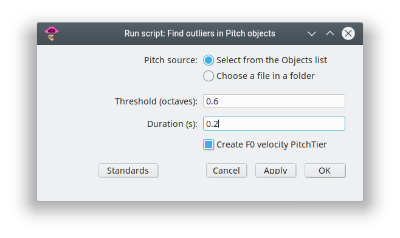

# f0-outliers.praat

Identify possible extraction errors in Pitch objects.

## Purpose

An f0 value is flagged as a potential extraction error if two condition are
met:
1. it differs from the previous f0 value by more than a frequency threshold (measured in octaves) defined by the user;
2. the two f0 values are separated in time by less than a threshold (measured in seconds) defined by the user.

## Parameters

Upon running the script, a window like the one below will appear, where the user has to set a number of parameters.

The parameters are:

- **Pitch folder** and **Grid folder**: path of folders where *Pitch* and *TextGrid* files are stored. They can be the same or different folders.
- **Report**: path of the folder and name of the file (with extension) of the report outputted by the script.

Default values for the frequency and time thresholds are 0.6 8va and 0.1 s. An absolute difference of 0.6 8va between adjacent f0 values corresponds to a change of about 50% (2^0.6).

## License

See the [LICENSE](LICENSE.md) file for license rights and limitations.

## How to cite

Click on the DOI badge above to see instructions on how to cite the script.
